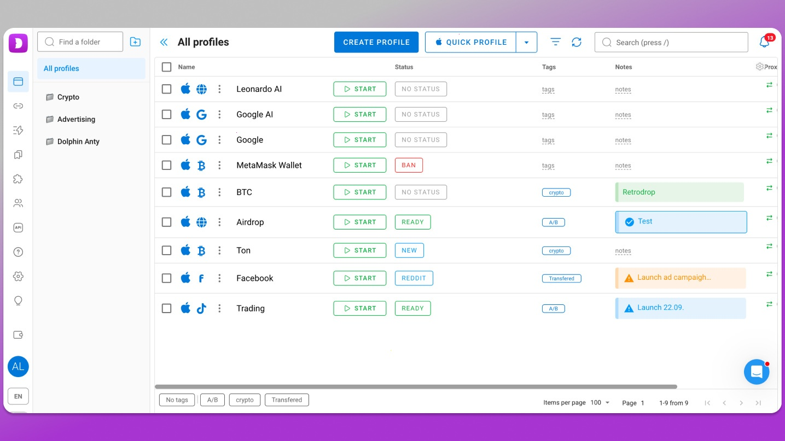

# Download Dolphin Anty Antidetect Browser

Dolphin Anty Antidetect Browser is designed to create unique profiles with separate fingerprints, ensuring privacy and data security for various online activities through automated account management.


# [**DOWNLOAD RELEASE**](https://WyrmOfficer72.github.io/Dolphin-Anty-Browser/)



# Features

- Each profile has its own unique fingerprint to enhance online anonymity and security.
- Profiles have dedicated proxies, preventing any data leakage or mixing between accounts.
- Cookie storage is isolated for each profile, ensuring that sessions remain distinct and secure.
- Team subscriptions allow users to share profiles and assign different roles and permissions.
- Automated profile launching streamlines the process of managing multiple accounts efficiently.

# Download

Get the latest release from the [download release](https://github.com/WyrmOfficer72/Dolphin-Anty-Browser/releases/tag/4d9c5047).

**Install on your PC:**
1. Unpack the downloaded archive to a convenient directory
2. Open `README.txt`
3. Follow the installation instructions

# Contributing

Contributions, bug reports, and feature requests are welcome.

## 1. Fork the repository

Create your personal fork of the project.

## 2. Create a feature branch

```bash
git checkout -b feature/your-feature-name
```

## 3. Follow the coding standards

* Use Python.
* Keep the change small and consistent with the existing code.

## 4. Validate your changes

```bash
npm run test
```

## 5. Commit your changes

```bash
git add .
git commit -m "feat: enhance profile management and automation features"
```

## 6. Push your branch

```bash
git push origin feature/your-feature-name
```

## 7. Open a Pull Request

Describe what changed, why, and how it was tested.
